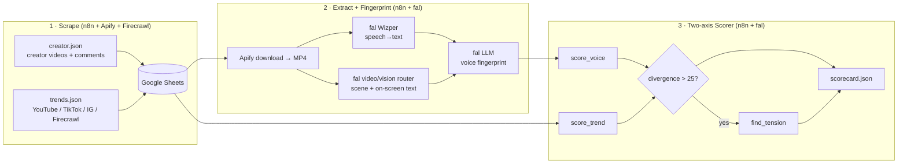

# Voiceprint

**The quality-control layer between a creator's AI generator and the publish button.**

AI-generated content is becoming a *legal* liability in Europe — EU AI Act Article 50 transparency obligations start **2 August 2026** — and an *audience* liability everywhere: consumer preference for AI-generated creator content fell from **60% (2023) to 26% (2026)**. Voiceprint defends a creator's authentic voice against generic AI slop.

> Built at the Cursor Social Media Hack, Stuttgart — 25 July 2026.

---

## The idea

Voiceprint is **not** a content generator (the market has ~258 of those). It's a **critic**.

1. **Fingerprint** — it builds a *voice fingerprint* of a specific creator by transcribing and analysing their best‑performing videos (weighted by engagement).
2. **Score on two independent axes** — for any new piece of content it measures, separately:
   - **Voice match** — how much it sounds like *that creator*
   - **Trend alignment** — how well it fits *what's currently working in their niche*
3. **Surface the tension** — these two pull in opposite directions. Every competing tool hides that by averaging them into one number. **We show the trade‑off and let the creator decide.** That tension is the headline feature.

> *"The trending hook is a hard cold‑open claim; your voice consistently opens with a question. Adopting the trend lifts reach but drops voice match to 41%."*

---

## Architecture

Four n8n pipelines, each reads and writes structured data — nothing is coupled, so no single failure kills the demo.



| Pipeline | File | Role |
|---|---|---|
| Creator scraper | `n8nWorkflows/creator.json` | creator videos + comments → Google Sheets |
| Trend scraper | `n8nWorkflows/trends.json` | multi‑source trends (YouTube, TikTok, Instagram, Firecrawl) → Sheets |
| **Extraction + Fingerprint** | `n8n/voiceprint_merged_cloud.workflow.json` | download → transcribe (Wizper) + analyse (video router) → **voice fingerprint** |
| **Two‑axis Scorer** | `n8nWorkflows/contentAnalysis.json` | candidate vs fingerprint + trends → **scorecard** with tension |

The two scorer axes are **two independent LLM calls** — never blended. A single blended call would silently average the axes and destroy the entire premise.

---

## It works — real output

Fingerprint generated end‑to‑end from a real creator (German food/comedy Shorts, 15 videos):

- **Voice traits** (each with a cited excerpt) — the model correctly identified that his real voice isn't "candy reviewer" but **engagement‑bait machinery**: it caught that *"like and subscribe if this cat deserves a home"* and *"5 YouTubers had a serious accident, click below"* repeat **verbatim across every video**.
- **Hook archetypes**, **pacing**, **signature phrases**, and **taboos** ("never delivers topic content without pivoting to engagement bait").

See `data/fingerprint.json` and `data/corpus.json` for the full artifacts.

---

## Sponsor tools (all used non‑decoratively)

| Tool | Used for |
|---|---|
| **fal.ai** | Wizper (speech→text), video/vision routers (scene + OCR), `openrouter/router` LLM for the fingerprint & scorer |
| **Apify** | video download (hosted MP4) + creator/trend scraping |
| **Firecrawl** | trend discovery in the trend pipeline |
| **n8n** | orchestrates all four pipelines |
| **Cursor** | built the entire project |

---

## Repo layout

```
n8n/            voiceprint_merged_cloud.workflow.json   — extraction + fingerprint (working)
n8nWorkflows/   creator.json · trends.json · contentAnalysis.json  — scrapers + scorer
data/           fingerprint.json · corpus.json · trends.json       — real outputs
backend/        ingest.py · map_sources.py               — reference logic / Excel→schema mapping
docs/           BUILD_SPEC.md · INGEST_PLAN.md · SCHEMA_MAPPING.md
                SCORER_BUILD_PROMPT.md · CREDENTIALS.md
```

## Run it

Workflows run on **n8n Cloud**. Credentials are **not** committed — see [`docs/CREDENTIALS.md`](docs/CREDENTIALS.md).

1. `cp .env.example .env` and fill in `FAL_KEY`, `APIFY_TOKEN` (shared out‑of‑band).
2. Import the workflow JSONs into n8n and attach the **fal** and **Apify** Header‑Auth credentials.
3. Run the extraction/fingerprint workflow → produces `fingerprint.json`; run the scorer against a candidate → produces `scorecard.json`.

Data contracts and stage specs: [`docs/BUILD_SPEC.md`](docs/BUILD_SPEC.md).

---

## Status & roadmap

**Working:** scrapers → Google Sheets · extraction + fingerprint (real output) · two‑axis scorer with tension gate.
**Next:** enhancer loop (rewrite → rescore to a voice threshold), EU AI Act disclosure marker, and a single‑page UI featuring the two‑axis meter.
